# FireDrill — SRE Incident Simulator

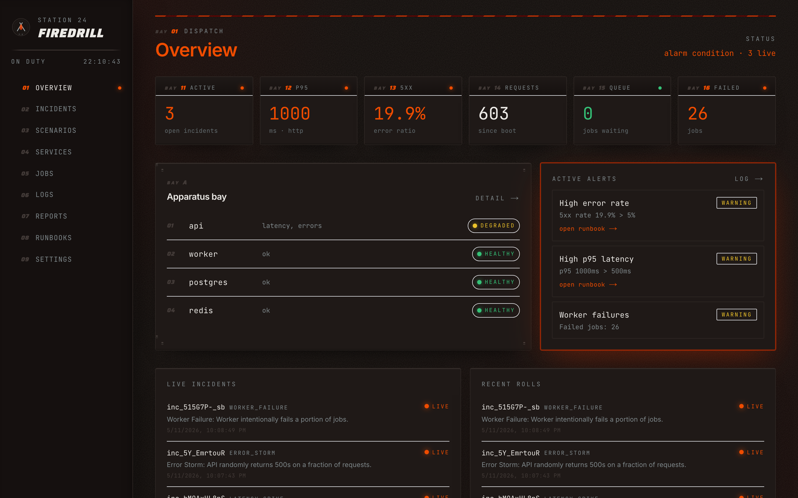

FireDrill is a self-hosted DevOps/SRE lab. It runs a small distributed
application locally with Docker Compose and lets you trigger realistic
incidents (latency spikes, error storms, database slowdowns, queue backlogs,
worker failures, memory pressure) from a station-house web dashboard. Metrics,
alerts, incident timelines, and post-incident reports all surface in real
time.

> Built as a portfolio project. **Do not run in production.** Memory pressure
> simulation is capped so it won't harm your laptop.

---

## Architecture

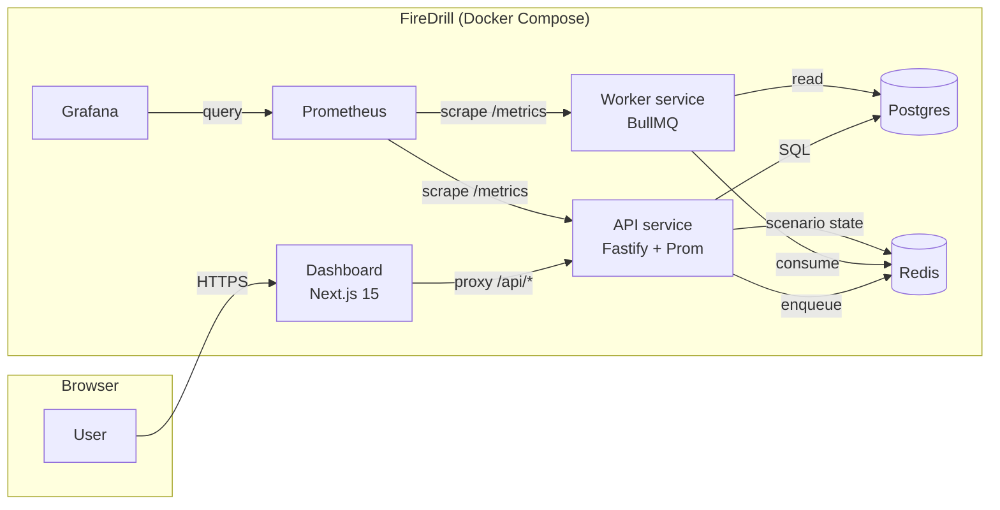

| Service     | Port (host) | Role                                            |
| ----------- | ----------- | ----------------------------------------------- |
| dashboard   | 3301        | Next.js control plane                           |
| api         | 4000        | HTTP API, scenario engine, metrics              |
| worker      | 4001        | BullMQ consumer, metrics                        |
| postgres    | 5532        | incidents, products, orders                     |
| redis       | 6479        | scenario state + BullMQ broker                  |
| prometheus  | 9090        | scrapes API + worker, evaluates alert rules     |
| grafana     | 3201        | dashboards (anonymous viewer enabled)           |

Host ports are remapped off the defaults so they don't collide with other local
stacks. Internal docker-network ports are unchanged.

---

## Incident scenarios

| Id                | Effect                                                                         |
| ----------------- | ------------------------------------------------------------------------------ |
| `latency_spike`   | Injects per-request delay into the API                                         |
| `error_storm`     | Random 500s on a configurable percentage of requests                           |
| `db_slowdown`     | Adds delay to every DB query; flips health to degraded                         |
| `queue_backlog`   | API enqueues jobs faster than the worker can drain them                        |
| `worker_failure`  | Worker throws on a configurable percentage of jobs                             |
| `memory_pressure` | API allocates a capped buffer (≤256 MB) and tracks it via Prom gauge           |

Each scenario:
- writes its state to Redis (`firedrill:scenario:<id>`)
- creates an `Incident` row in Postgres on enable, resolves it on disable
- toggles the `firedrill_scenario_active{scenario="…"}` Prometheus gauge
- has a runbook in `/runbooks` and at `/runbooks` in the dashboard

---

## Run it

```bash
cp .env.example .env
docker compose up --build
```

Open:
- Dashboard:      http://localhost:3301
- API:            http://localhost:4000/health
- Prometheus:     http://localhost:9090
- Grafana:        http://localhost:3201  (anonymous viewer + admin/admin)
- Worker metrics: http://localhost:4001/metrics

Shut down with `docker compose down -v`.

### How to trigger an incident

From the dashboard:

1. Open **Scenarios**.
2. Click **enable** on any scenario card.
3. Watch the Overview page — metrics, services, and alerts react within seconds.
4. The Incidents page shows the open incident; click in to see its timeline.
5. Click **resolve**, then **generate report** — you get a post-incident report.

Or via API:

```bash
# enable latency spike
curl -X POST http://localhost:4000/api/simulate/latency_spike \
  -H 'content-type: application/json' \
  -d '{"enabled": true, "intensity": 600}'

# disable everything
curl -X POST http://localhost:4000/api/simulate/reset
```

---

## Monitoring architecture

Prometheus scrapes:
- `api:4000/metrics` — HTTP requests, latencies, DB queries, scenario gauges
- `worker:4001/metrics` — jobs processed, job duration, queue depth

Prometheus evaluates alert rules in `infra/prometheus/rules.yml`. The dashboard
also evaluates a parallel set of simple alerts on `/api/overview` so users see
something even when Prometheus is still warming up.

### Exposed Prometheus metrics (firedrill prefix)

| Metric                                     | Type      | Where  |
| ------------------------------------------ | --------- | ------ |
| `firedrill_http_requests_total`            | counter   | api    |
| `firedrill_http_request_duration_seconds`  | histogram | api    |
| `firedrill_db_query_duration_seconds`      | histogram | api    |
| `firedrill_database_healthy`               | gauge     | api    |
| `firedrill_scenario_active`                | gauge     | api    |
| `firedrill_memory_ballast_bytes`           | gauge     | api    |
| `firedrill_active_incidents`               | gauge     | api    |
| `firedrill_jobs_processed_total`           | counter   | worker |
| `firedrill_jobs_failed_total`              | counter   | worker |
| `firedrill_job_duration_seconds`           | histogram | worker |
| `firedrill_queue_depth`                    | gauge     | worker |

Plus default Node process metrics (`process_*`, `nodejs_*`).

### Grafana

A FireDrill dashboard is provisioned automatically from
`infra/grafana/provisioning/dashboards/firedrill.json`. Anonymous viewer access
is on, so you can open Grafana at http://localhost:3001 without logging in.

---

## Runbook examples

See `/runbooks` in the repo and `/runbooks` in the dashboard. Each runbook
includes symptoms, detection queries, immediate mitigation, long-term fix, and
useful commands.

- `runbooks/latency_spike.md`
- `runbooks/error_storm.md`
- `runbooks/db_slowdown.md`
- `runbooks/queue_backlog.md`
- `runbooks/worker_failure.md`
- `runbooks/memory_pressure.md`

---

## Screenshots

### Overview — all bays green
The dispatch board at rest. Six metric tiles across the top, apparatus bay
status on the left, alerts panel on the right (radio silent), incident logs
across the bottom.

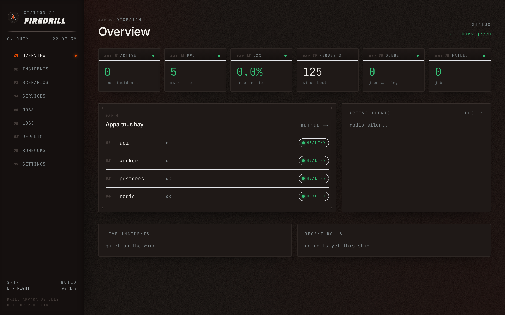

### Overview — alarm condition
Two scenarios live (`latency_spike` and `error_storm`). The header strip
flips to the orange alarm pattern, status reads `alarm condition · 2 live`,
the metric tiles light up red where they breach SLO, alerts populate with
links to runbooks, and the incident lists show live incidents pulsing.

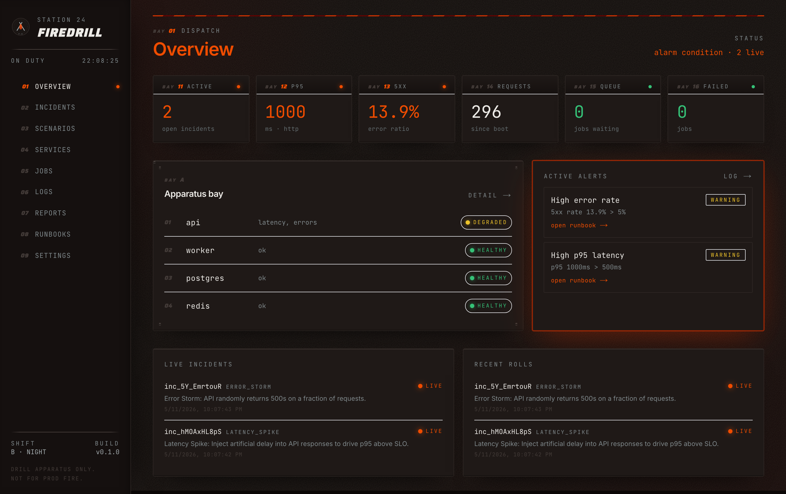

### Scenarios — controls
Each scenario is a bay on the dispatch board. Trigger one and the card flips
to ember; intensity, started timestamp, duration, and affected services
update live; the active incident id links straight to the timeline.

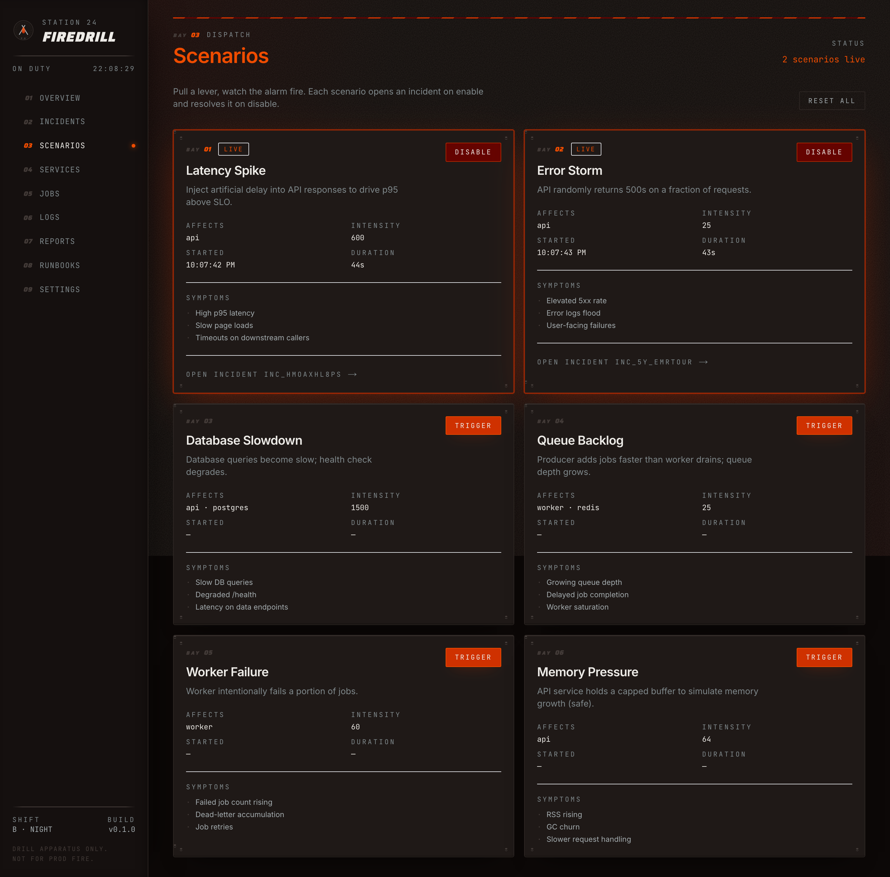

### Incident detail + post-incident report
Open an incident to see the timeline, then click **generate report** for a
template-driven postmortem (detected symptoms, suspected root cause,
remediation, prevention) without needing an LLM.

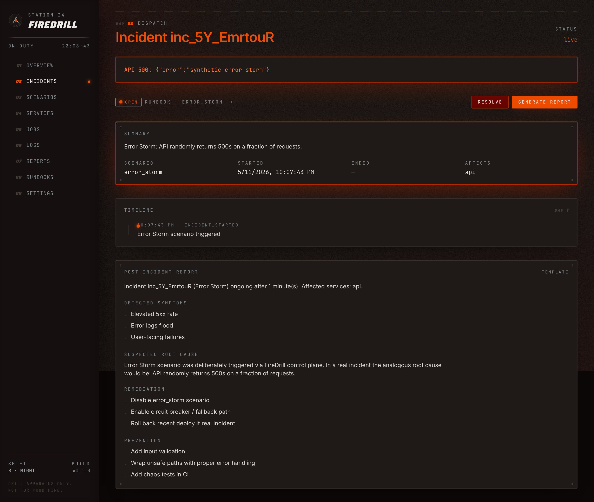

### More
| Cold scenarios | Incidents log | Services |
|---|---|---|
| 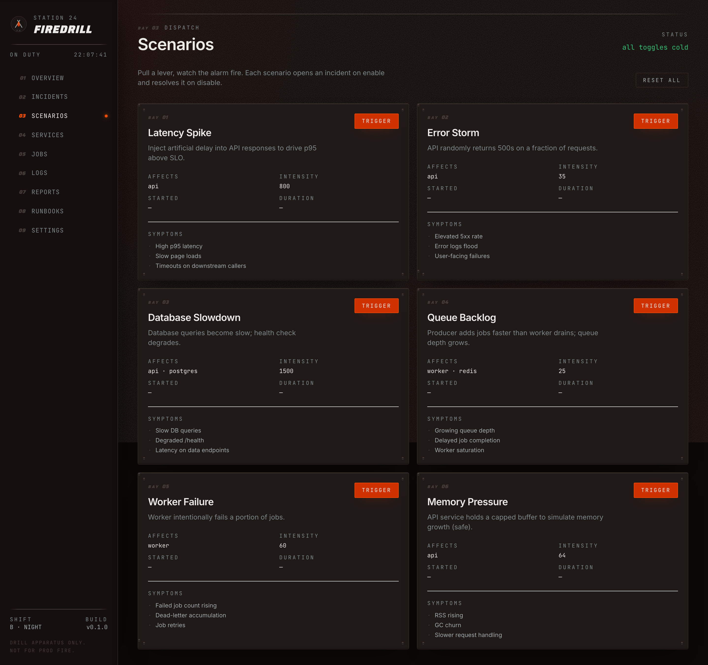 | 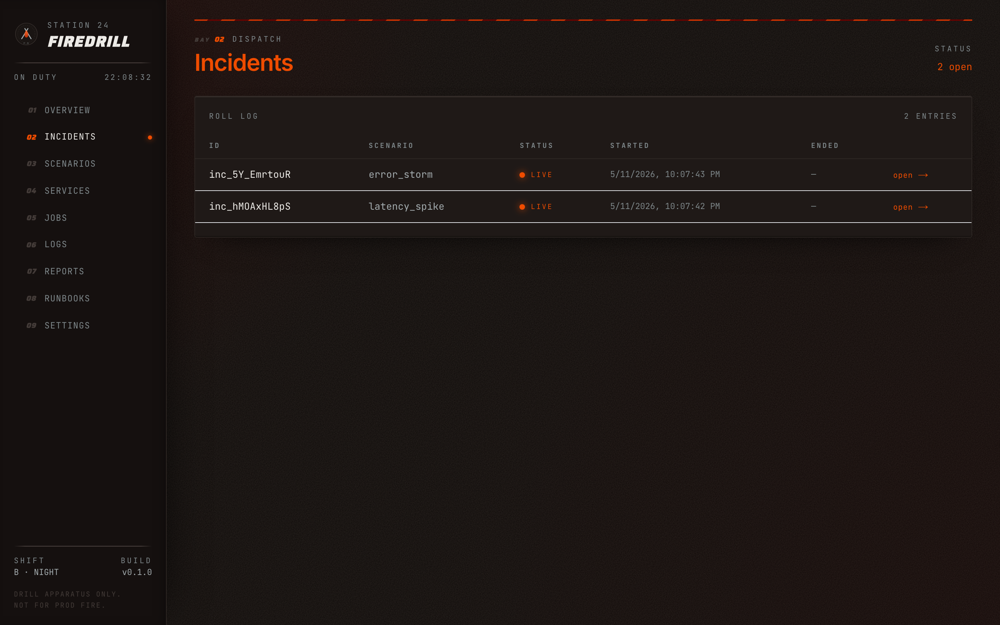 | 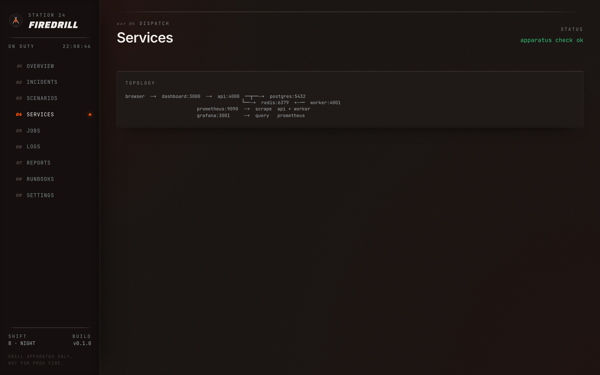 |

| Jobs & queues | Logs | Reports |
|---|---|---|
| 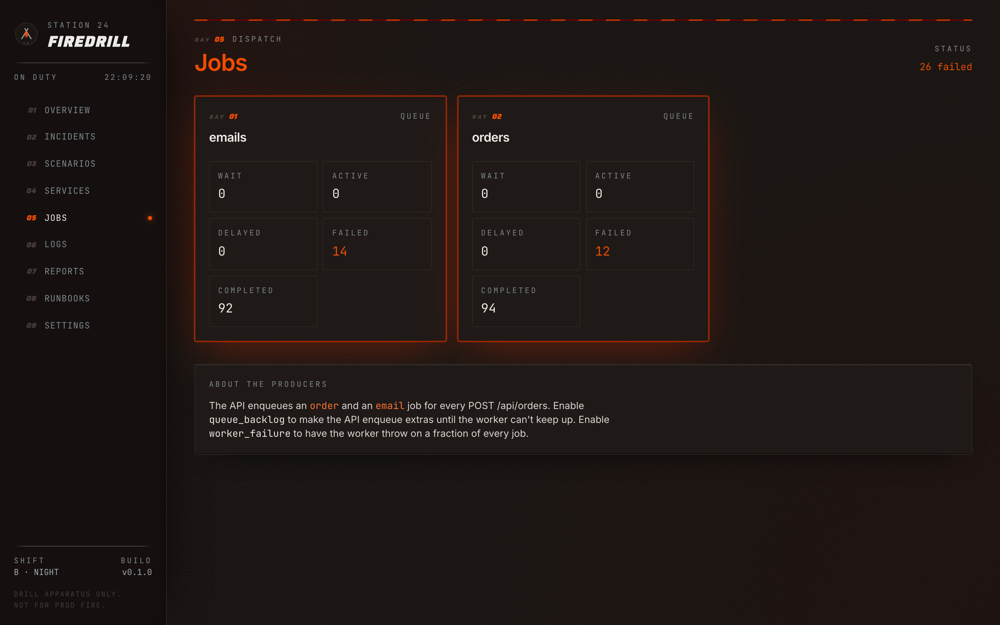 | 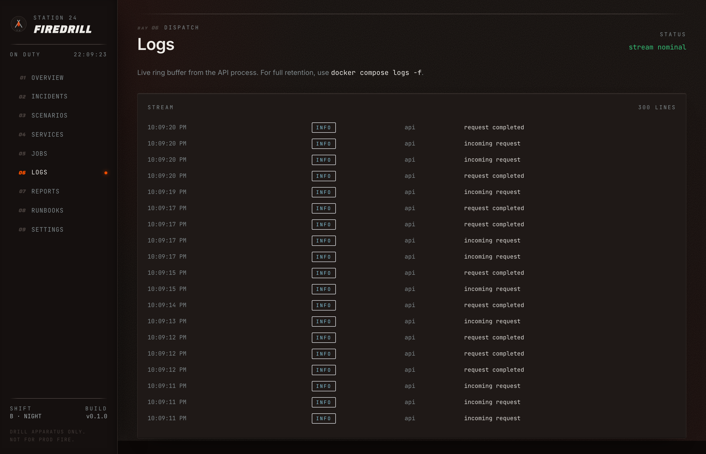 | 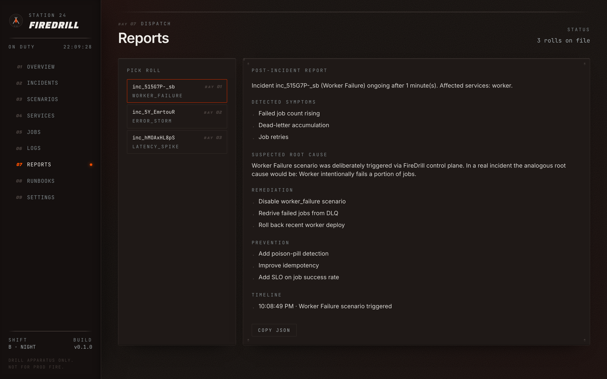 |

| Runbooks | Settings |
|---|---|
| 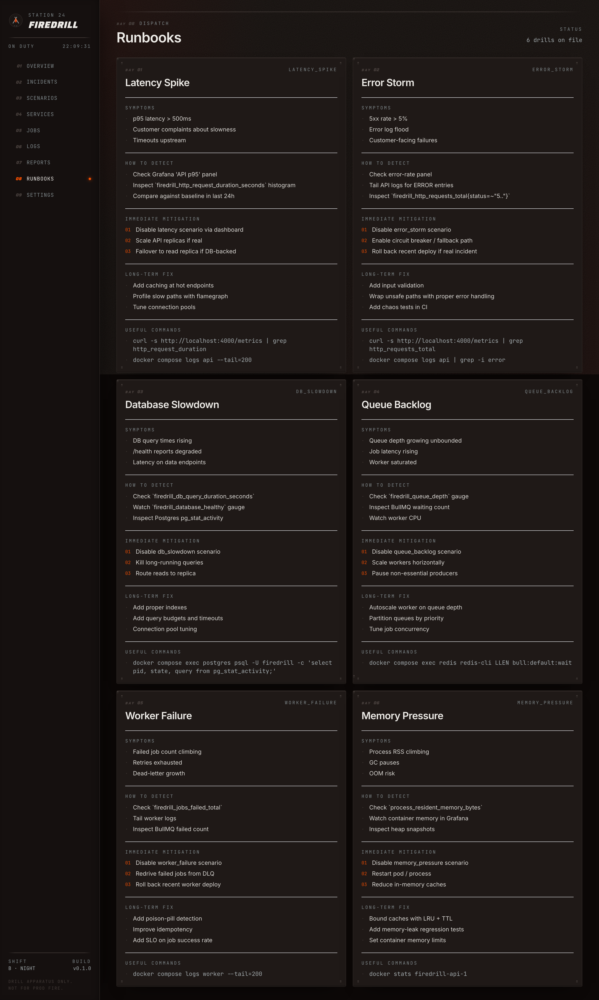 | 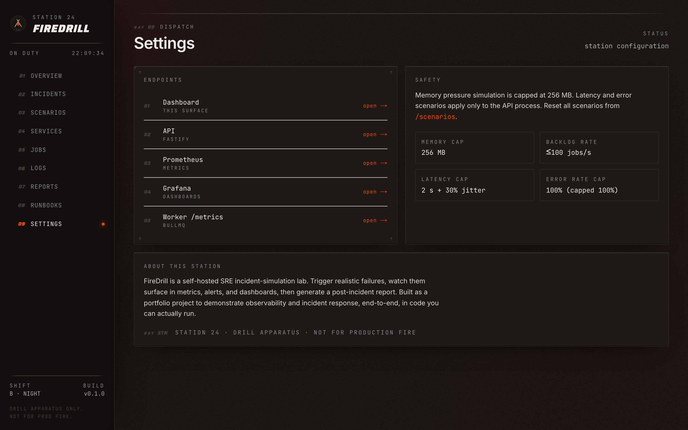 |

---

## Testing

```bash
# unit tests for api + worker (vitest)
docker compose run --rm api npm test
docker compose run --rm worker npm test

# or, locally, after `npm install`:
npm test --workspaces

# end-to-end (Playwright, requires the stack to be running)
npm run test:e2e
```

The Playwright suite drives the dashboard:
1. Opens the dashboard.
2. Enables `latency_spike`.
3. Confirms the active incident appears.
4. Disables the scenario.
5. Generates a post-incident report.

---

## Future improvements

- Per-route scenario targeting (degrade only specific endpoints).
- Loki + Promtail for proper log pipeline.
- OpenTelemetry traces across api ↔ worker via Tempo.
- LLM-generated post-incident reports when `OPENAI_API_KEY` is set.
- Game-day scoring: time-to-detect, time-to-mitigate per scenario.
- Multi-region simulation (extra API replicas with different scenarios).
